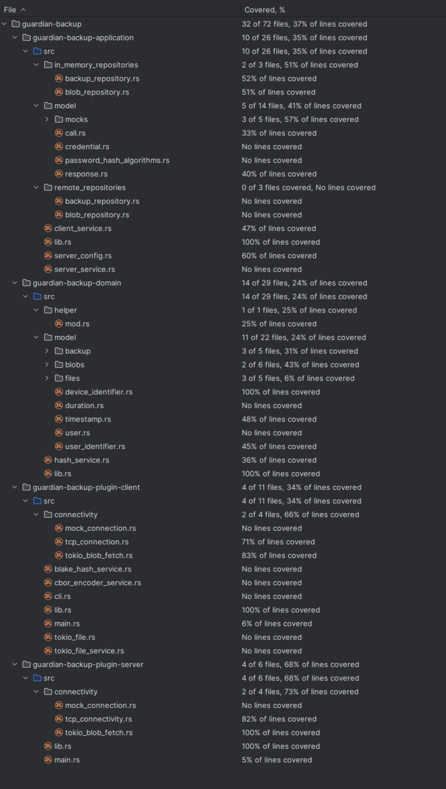

# Programmentwurf Guardian-Backup

Karl Mörtzschky  
Benedikt Kuder

07.06.2024

# Kapitel 1 - Einführung

## Übersicht über die Applikation

> Was macht die Applikation? Wie funktioniert sie? Welches Problem löst sie/welchen Zweck hat sie?

Bei Guardian-Backup handelt es sich um eine pseudo-offline Backup-Lösung.
Dabei erstellt ein Client ein Backup und lädt dieses auf den Server hoch.
Der Client kann allerdings nur neue Backups erzeugen und keine löschen.
Das Löschen von Backups wir durch eine Retention-Policy umgesetzt.
Durch die Inhaltsadressierung der einzelnen Dateien findet automatisch eine Deduplizierung statt.

## Wie startet man die Applikation?

> Wie startet man die Applikation? Welche Voraussetzungen werden benötigt? Schritt-für-Schritt-Anleitung

### Bauen der Artefakte

Für das Bauen der Artefakte ist eine Rust-Toolchain auf aktueller Version (>= 1.78.0) notwendig.
Diese kann mit [Rustup](https://rustup.rs/) installiert werden.

Das Binary kann mithilfe des folgenden Befehls generiert werden:

```sh
cargo build --release --package guardian-backup-plugin-client --bin guardian-backup-plugin-client
```

Das Server Binary wird wiederum mit folgendem Befehl erzeugt:

```sh 
cargo build --release --package guardian-backup-plugin-server --bin guardian-backup-plugin-server
```

Die Artefakte befinden sich darauf in `target/release`

### Verwendung

Starte zuerst den Server, indem du das Binary guardian-backup-server ausführst.

Die Grundfunktionen können über folgende Befehle ausgeführt werden:

#### Server starten

Damit der Client funktioniert, muss zuerst der Server gestartet werden:

```sh
./target/release/guardian-backup-plugin-server
```

#### Backup Erstellen

Um ein Backup zu erstellen, kann folgender Befehl genutzt werden:

```sh
./target/release/guardian-backup-plugin-client backup create --name <backup_id> --backup-root <Path to folder which should be backuped>
```

Beachte, dass der Server keine Backups persistiert. Ein Neustart des Servers löscht also alle bisher erstellten Backups.

#### Backup Wiederherstellen

Um ein Backup wiederherzustellen, kann folgender Befehl genutzt werden:

```sh
./target/release/guardian-backup-plugin-client backup restore --backup-id <backup_id> --file-root <Pfad wo das Backup wiederhergestellt werden soll>
```

Die Anwendung baut darauf die Differenz zwischen Dateisystem und Backup auf und behebt diese.

## Wie testet man die Applikation?

> Wie testet man die Applikation? Welche Voraussetzungen werden benötigt? Schritt-für-Schritt-Anleitung

Um die Anwendung zu testen, kann man _im Projektordner_ den folgenden Befehl ausführen:

```sh
cargo test --workspace
```

# Kapitel 2 - Clean Architecture

## Was ist Clean Architecture?

> allgemeine Beschreibung der Clean Architecture in eigenen Worten

Unter Clean Architecture versteht man eine Sammlung an Konzepten, welche darauf abzielen, komplexe Softwaresysteme in
leichter verständliche Komponenten aufzuteilen.

Im Wesentlichen wird die Anwendung dabei in mehrere Schichten unterteilt.
Jede Schicht greift dabei nur auf diejenigen Schichten zu, welche tiefer liegen zu.

In der äußersten Schicht (Plugin-Schicht) werden dann Abhängigkeiten in die unterliegenden Schichten injiziert und die
Benutzerschnittstelle definiert.

Darunter liegt eine Adapter-Schicht, welche in diesem Projekt in die Plugin-Schicht integriert wurde.
Hier werden Adapter definiert, um externen Bibliotheken ein einheitliches Interface zu geben, sodass die Abhängigkeiten
später einfach ausgetauscht werden können.

Unter der Adapter-Schicht liegt die Anwendungs-Schicht, in welcher Anwendungslogik definiert wird.
Hier werden User-Stories implementiert, welche nicht mehr Teil der Domänenlogik sind.

In der für dieses Projekt tiefsten Schicht wird die Domänenlogik selbst implementiert.
Dabei handelt es sich um Logik, welche von einem Domänenexperten vollständig beschrieben werden kann.
Es werden also Abläufe und Zusammenhänge so abgebildet, wie diese auch in der Domäne selbst stattfinden.

## Analyse der Dependency Rule

> (1 Klasse, die die Dependency Rule einhält und eine Klasse, die die Dependency Rule verletzt); jeweils UML der Klasse
> und Analyse der Abhängigkeiten in beide Richtungen (d.h., von wem hängt die Klasse ab und wer hängt von der Klasse ab)
> in Bezug auf die Dependency Rule

### Positiv-Beispiel: Dependency Rule


Die Klasse `TcpServerConnectivity` (Plugin-Schicht) implementiert `ConnectionServerInterface` (Anwendungs-Schicht) und
kann so in der Anwendungs-Schicht verwendet werden, obwohl die TCP-Implementation _tokio_ als externe Bibliothek
verwendet.

### Negativ-Beispiel: Dependency Rule


Die Klasse `Backup` (Domänen-Schichte) implementiert `Serialize` und `Deserialize`. Beide Interfaces werden in der
externen Bibliothek _serde_ definiert. Dieser Bruch der Dependency rule wird hingenommen, da _serde_ als sehr stabil
gilt
und es als unwahrscheinlich anzunehmen ist, dass die verwendeten Interfaces sich noch ändern werden. Eine
Re-Implementation von
_serde_-Interfaces schien nicht sinnvoll.

## Analyse der Schichten

> jeweils 1 Klasse zu 2 unterschiedlichen Schichten der Clean-Architecture: jeweils UML der Klasse (ggf. auch
> zusammenspielenden Klassen), Beschreibung der Aufgabe, Einordnung mit Begründung in die Clean-Architecture

### Schicht: [Domäne]


Die Klasse `Snapshot` beschreibt den Zustand eines Dateibaums zu einem diskreten Zeitpunkt.
Es handelt sich um ein Domänenobjekt, da ein Domänenexperte (wie z.B. ein Sysadmin) mit dem Begriff Snapshot vertraut
ist.
In der Domäne werden auch zur Systemsicherung manuell Snapshots angelegt.

### Schicht: [Anwendung]


Die `InMemoryBackupRepository`-Klasse ist eine Implementierung des `BackupRepository`-Interfaces.  
Sie speichert Backup-Objekte direkt im Arbeitsspeicher.  
Da es sich bei der Art der Speicherung um ein Implementierungsdetail handelt und keine externen Komponenten notwendig
sind, ist diese Klasse in die Anwendungs-Schicht einzuordnen.

# Kapitel 3 - SOLID

## Analyse Single-Responsibility-Principle (SRP)

> jeweils eine Klasse als positives und negatives Beispiel für SRP; jeweils UML der Klasse und Beschreibung der Aufgabe
> bzw. der Aufgaben und möglicher Lösungsweg des Negativ-Beispiels (inkl. UML)

### Positiv-Beispiel


Das Interface `BlobFetch`, bzw. die Implementierungen `InMemoryBlobFetch` und `TokioBlobFetch` sind dafür zuständig
BLOBs zu repräsentieren.
Dabei muss im Fall des `TokioBlobFetch` der BLOB selbst zu keinem Zeitpunk vollständig im Arbeitsspeicher vorliegen.
Das SRP ist erfüllt, da es nur die Funktion des Lesens eines BLOBs implementiert.

### Negativ-Beispiel


Die Klasse `MainServerService` ist dafür zuständig, eingehende Anfragen zu bearbeiten. Dabei ist vor allem die
Methode `internal_handle()` problematisch, da sie die Logik für alle Arten von Anfragen implementiert.
So ist das Prinzip der Single Responsibility gebrochen.
Ein Lösungsansatz dafür wäre es, die Logik zur Abarbeitung der Anfragen auszulagern. Beispielsweise könnte diese Logik
direkt als Methode `handle()` in der Anfrage selbst implementiert werden.  


## Analyse Open-Closed-Principle (OCP)

> jeweils eine Klasse als positives und negatives Beispiel für OCP; jeweils UML der Klasse und Analyse mit Begründung,
> warum das OCP erfüllt/nicht erfüllt wurde – falls erfüllt: warum hier sinnvoll/welches Problem gab es? Falls nicht
> erfüllt: wie könnte man es lösen (inkl. UML)?

### Positiv-Beispiel

  
Die Klasse `HashService` verwaltet verschiedene `Hasher` und hat die Aufgabe je nach Situation den korrekten `Hasher`
auszuwählen.
Das OCP ist erfüllt, da der `HashService` gegen Änderungen geschlossen ist (das Hinzufügen eines neuen `Hashers` ist
alleine über das Hinzufügen eines Objektes in `supported_hashers` möglich).
Dennoch ist der `HashService` offen, da weiterhin neue `Hasher` hinzugefügt werden können.

### Negativ-Beispiel

Die Methode `internal_handle` zusammen mit dem Enum `Call` erfüllen nicht das OCP, da das Hinzufügen einer neuen `Call`
-Variante eine Abänderung des Switch-Statements innerhalb `internal_handle` notwendig ist.

aktueller Pseudo-Code:

```rust
async fn internal_handle(
    &mut self,
    call: &mut impl IncomingCall,
    call_variant: Call,
) -> Result<(), ServerServiceError> {
    let user = call.user();

    match call_variant {
        Call::CreateBackup(backup) => { ... }
        Call::GetBackups => { ... }
        Call::PatchBackup(mut backup) => { ... }
        Call::CreateBlob(id) => { ... }
        Call::GetBlob(id) => { ... }
    }
}
```

Dies könnte wie im SOLID Negativ-Beispiel beschrieben durch das Auslagern der Logik in den `Command` selbst gelöst
werden.
Der verbesserte PseudoCode würde dann folgendermaßen aussehen:

```rust
async fn internal_handle(
    &mut self,
    call: &mut impl IncomingCall,
    call_variant: Call,
) -> Result<(), ServerServiceError> {
    call_variant.handle(call.user())
}
```

## Analyse Liskov-Substitution- (LSP), Interface-Segreggation- (ISP), Dependency-Inversion-Principle (DIP)

> jeweils eine Klasse als positives und negatives Beispiel für entweder LSP oder ISP oder DIP); jeweils UML der Klasse
> und Begründung, warum man hier das Prinzip erfüllt/nicht erfüllt wird
> Anm.: es darf nur ein Prinzip ausgewählt werden; es darf NICHT z.B. ein positives Beispiel für LSP und ein negatives
> Beispiel für ISP genommen werden

### Positiv-Beispiel

  
Das Interface `BlobFetch` ist ein gutes Beispiel für eine gelungene Liskov-Substitution.
Die Klassen `InMemoryBlobFetch` und `TokioBlobFetch` implementieren `BlobFetch` und erfüllen diesen Vertrag vollständig.
Sie können also gegen einender ausgetauscht werden, ohne dass ein aufrufendes Modul eine Änderung des Verhaltens
beobachten kann.

### Negativ-Beispiel


Das Interface `ConnectionClientInterface` wird von `TcpConnection` und `MockConnection` implementiert.
Der Natur einer Mock-Implementation entsprechend bricht `MockConnection` den in `ConnectionClientInterface` vereinbarten
Vertrag, indem z.B. der Rückgabewert der Funktionen unabhängig von den Parametern dieser sind.
So kann auf ein `Command::GetBlob` mit einer `Response::BackupList` zurückgegeben werden. Dies ist in einer Anwendung,
in
welcher alle Komponenten sich wie spezifiziert verhalten, nicht möglich. Eine `TcpConnection` kann also nicht einfach
durch eine `MockConnection` ausgetauscht werden.

Da dieses Verhalten im Rahmen von Unit-Tests gewünscht ist, wird hier kein wirklicher Lösungsvorschlag gegeben.

## Kapitel 4 - Weitere Prinzipien

### Analyse GRASP: Geringe Kopplung

> jeweils eine bis jetzt noch nicht behandelte Klasse als positives und negatives Beispiel geringer Kopplung; jeweils
> UML Diagramm mit zusammenspielenden Klassen, Aufgabenbeschreibung und Begründung für die Umsetzung der geringen
> Kopplung
> bzw. Beschreibung, wie die Kopplung aufgelöst werden kann

### Positiv-Beispiel


Als Positivbeispiel für geringe Kopplung dient die Klasse `MainServerService`.
Sie ist für die Handhabung eingehender `Command`s zuständig..
Die Klasse selbst nutzt lediglich Interfaces als Member-Variablen und implementiert selbst das `ServerService`
-Interface.
So kann die Implementation der Member-Variablen selbst jederzeit ausgetauscht werden, ohne dass `MainServerService`
angepasst werden muss.
Es kann auch der ganze `MainServerService` durch eine andere Implementation eines `ServerService` ersetzt werden, ohne
dass der Rest der Anwendung angepasst werden muss.

### Negativ-Beispiel


Die Klasse `Schedule` beschreibt den Rhythmus in welchem Backups erstellt werden sollen.  
Dieser Plan besteht aus mehreren `ScheduleRule` welche jeweils eine Regel sowie deren letzte Ausführung beschreiben.  
Hier handelt es sich um starke Kopplung, da der `Schedule` selbst immer direkt verwendet wird, und auch
die `ScheduleRule`s dirket eingebunden sind.
Ein einfaches Austauschen der Implementationen ist so nicht möglich.

Die starke Kopplung kann durch das Einführen von Interfaces aufgelöst werden:  


## Analyse GRASP: Hohe Kohäsion

> eine Klasse als positives Beispiel hoher Kohäsion; UML Diagramm und Begründung, warum die Kohäsion hoch ist

## Don’t Repeat Yourself (DRY)

> ein Commit angeben, bei dem duplizierter Code/duplizierte Logik aufgelöst wurde; Code-Beispiele (vorher/nachher);
> begründen und Auswirkung beschreiben

# Kapitel 5 - Unit Tests

## 10 Unit Tests

> Nennung von 10 Unit-Tests und Beschreibung, was getestet wird+

 Unit Test                                                                                                        | Beschreibung                                                                                                                         
------------------------------------------------------------------------------------------------------------------|--------------------------------------------------------------------------------------------------------------------------------------
 server::TcpConnection::test_receive_request                                                                      | testet, ob der Server eingehende `Command`s empfangen und richtig parsen kann                                                        
 server::TcpConnection::test_send_response                                                                        | testet, ob der Server ausgehende `Response`ses korrekt encoded und sendet                                                            
 server::TcpConnection::test_receive_blob                                                                         | testet, ob der Server bei eingehenden `Commands`s auch BLOBS korrekt empfangen kann                                                  
 server::TcpConnection::test_send_response_with_blob                                                              | testet, ob der Server bei ausgehenden `Response`s BLOB korrekt senden kann                                                           
 client::TcpConnection::test_send_request()                                                                       | testet, ob der Client `Command`s korrekt encoden und senden kann und ob Responses korrekt empfangen werden                           
 client::TcpConnection::test_send_request_blob()                                                                  | testet, ob der Client bei `Command`s BLOBs korrekt mitsenden kann und ob Responses korrekt empfangen werden                          
 client::TcpConnection::test_receive_blob()                                                                       | testet, ob der Client Responses mit BLOBs korrekt empfangen kann                                                                     
 guardian_backup_application::client_service::tests::test_if_create_backup_creates_backup()                       | Testet, ob der Client Backups speichert, wenn ein `Backup create command` entgegen genommen wird                                     
 guardian_backup_application::client_service::tests::test_if_create_backup_contains_right_backup()                | Testet, ob der Client das richtige Backup (ohne retention policy) speichert, wenn ein `Backup create command` entgegen genommen wird 
 guardian_backup_application::client_service::tests::test_if_create_backup_contains_right_backup_with_retention() | Testet, ob der Client das richtige Backup (mit retention policy) speichert, wenn ein `Backup create command` entgegen genommen wird  

## ATRIP: Automatic

> Begründung/Erläuterung, wie ‘Automatic’ realisiert wurde

Die Tests wurden mithilfe von Cargo tests umgesetzt.
So können durch `sh cargo tests` automatisiert alle Tests gestartet werden. Ergebnisse werden in der Konsole
zusammengefasst.
Eine Integration in gängige IDEs ist hierdurch auch gegeben.
Durch den Rückgabewert des Prozesses können die Tests einfach in Pipelines eingebaut werden.

## ATRIP: Thorough

> jeweils 1 positives und negatives Beispiel zu ‘Thorough’; jeweils Code-Beispiel, Analyse und Begründung, was
> professionell/nicht professionell ist

### Positives Beispiel

```rust

#[tokio::test]
async fn test_receive_request() {
    let server_config = ServerConfig::test_config();
    let mut server = TcpServerConnectivity::new(&server_config).await.unwrap();
    send_call(server_config.bind_to).await;

    let call = server.receive_request().await.unwrap();

    if let Call::CreateBackup(_) = call.inner() {} else {
        panic!("Expected Create Backup Call")
    }
}

#[tokio::test]
async fn test_send_response() {
    let server_config = ServerConfig::test_config();
    let mut server = TcpServerConnectivity::new(&server_config).await.unwrap();
    let mut client = send_call(server_config.bind_to).await;

    let mut call = server.receive_request().await.unwrap();

    call.answer(Response::Successful).await.unwrap();

    let received_response = receive_response(&mut client).await;

    assert_eq!(received_response, Response::Successful);
}

#[tokio::test]
async fn test_receive_blob() {
    let server_config = ServerConfig::test_config();
    let mut server = TcpServerConnectivity::new(&server_config).await.unwrap();
    let (_rx, tx) = send_call(server_config.bind_to).await.into_split();
    send_blob(tx).await;

    let mut call = server.receive_request().await.unwrap();
    let mut blob = call.receive_blob().await.unwrap();

    let blob_content = blob.read_to_eof().await.unwrap();

    assert_eq!(blob_content.as_ref(), &[127; 4096])
}

#[tokio::test]
async fn test_send_response_with_blob() {
    let server_config = ServerConfig::test_config();
    let mut server = TcpServerConnectivity::new(&server_config).await.unwrap();
    let mut client = send_call(server_config.bind_to).await;

    let mut call = server.receive_request().await.unwrap();

    call.answer_with_blob(
        Response::Successful,
        InMemoryBlobFetch::new([127; 4096].into()),
    )
        .await
        .unwrap();

    let received_response = receive_response(&mut client).await;
    assert_eq!(received_response, Response::Successful);

    let mut received_blob = receive_blob(client).await;
    let received_blob_data = received_blob.read_to_eof().await.unwrap();
    assert_eq!(received_blob_data.as_ref(), &[127; 4096])
}
```

In `server::TcpServerConnectivity` wurde ‘Thorough’ getestet.
Eine Verbindung kann nur `Command`s empfangen und `Request`s senden.
Beide Aktionen sind mit und ohne BLOB möglich. Es gibt also insgesamt vier mögliche Variationen.
Die Unit-Tests decken alle vier Variationen ab und sind damit ‘Thorough’.

### Negatives Beispiel

In `MainClientService` wurde nicht ‘Thorough’ getestet.
Der Service kann sowohl backups erstellen, als auch backups wiederherstellen.
Getestet wurde allerdings nur, ob Backups korrekt erstellt werden.
Es müssen also noch Unit-Tests für die
Methoden: `handle_command()`, `upload_to_repository_from_file_tree()`, `resolve_diffs()` und `recursive_create_in_fs`
erstellt werden.

```rust
#[tokio::test]
async fn test_if_create_backup_creates_backup() {
    { ... }
}

#[tokio::test]
async fn test_if_create_backup_contains_right_backup() {
    { ... }
    assert_eq!(backups_repo, expected_backup);
}

#[tokio::test]
async fn test_if_create_backup_contains_right_backup_with_retention() {
    { ... }
    assert_eq!(backups_repo, expected_backup);
}
```

## ATRIP: Professional

> jeweils 1 positives und negatives Beispiel zu ‘Professional’; jeweils Code-Beispiel, Analyse und Begründung, was
> professionell/nicht professionell ist

### Positives Beispiel

Als positives Beispiel dient `server::TcpServerConnectivity::test_receive_request()`.
Die Professionalität ist hier aus mehreren Gründen gegeben:

1. Der Name beschreibt, was die Funktion testet
2. Bestehender Code wird wiederverwendet (send_call)
3. Der Test testet tatsächliche Logik und Interaktion zwischen Modulen und ist damit sinnvoll.

```rust
#[tokio::test]
async fn test_receive_request() {
    let server_config = ServerConfig::test_config();
    let mut server = TcpServerConnectivity::new(&server_config).await.unwrap();
    send_call(server_config.bind_to).await;

    let call = server.receive_request().await.unwrap();

    if let Call::CreateBackup(_) = call.inner() {} else {
        panic!("Expected Create Backup Call")
    }
}
```

### Negatives Beispiel

# fettes TODO Karl

## Code Coverage

> Code Coverage im Projekt analysieren und begründen

# todo abnahme


Die Code coverage unterscheidet sich etwas über die verschiedenen Komponenten des Projektes hinweg.
In der folgenden Tabelle sind die verschiedenen line-tested Anteile pro Komponente aufgelistet.

 Unit Test               | Beschreibung 
-------------------------|--------------
 Anwendungs-Schicht      | 35 %         
 Domänen-Schicht         | 24 %         
 Plugin-Schicht (Server) | 68 %         
 Plugin-Schicht (Client) | 34 %         
 Gesamt                  | 37 %         

Besonders auffällig sind die 24 % der Domänen-Schicht.
Hier wurde viele Funktionen modelliert, die später nicht umgesetzt wurden.

Während einzelne Komponenten wie die `TCP-Connection` umfangreicher getestet wurden, ist dies nicht für das gesamte
Projekt erfolgt.
Dies ist auf die Anforderung von 10 Unit-Tests zurückzuführen.
Diese reichen bei weitem nicht aus um das Projekt mit einem Umfang von über 3.000 Zeilen ausreichend zu testen.
Es ist daher wahrscheinlich, dass ungewolltes Verhalten in den weniger getesteten Komponenten vorliegt.
Eine höhere Abdeckung wäre hier wünschenswert gewesen.

## Fakes und Mocks

> Analyse und Begründung des Einsatzes von 2 Fake/Mock-Objekten; zusätzlich jeweils UML Diagramm der Klasse

### Beispiel 1


Die Klasse `MockHasher` stellt eine Mock-Implementation des `Hasher`-Interfaces dar.
Sie wurde erstellt damit Komponenten getestet werden können, obwohl eine vollständige Implementation des
Hasher-Interfaces noch nicht existierte.
So wird der MockHasher in den Unit-Tests von `MainClientService` genutzt und ermöglicht es dessen Funktionalität ohne
konkrete Hasher-Implementation zu testen.

### Beispiel 2


Die Klasse `MockEncoderService` stellt eine Mock-Implementation des `EncoderService`-Interfaces dar.
Es gilt dieselbe Begründung wie im obigen Beispiel.

# Kapitel 6 - Domain Driven Design

## Ubiquitous Language

> 4 Beispiele für die Ubiquitous Language; jeweils Bezeichung, Bedeutung und kurze Begründung, warum es zur Ubiquitous
> Language gehört

 Bezeichung   | Bedeutung   | Begründung                                                                                                                                                                                                                      
--------------|-------------|---------------------------------------------------------------------------------------------------------------------------------------------------------------------------------------------------------------------------------
 BLOB         | Binärstring | Ein BLOB beschreibt ein binär dargestelltes Objekt. So besteht eine File z.B. aus Metadaten und BLOB.                                                                                                                           
 FileTreeNode | Datei       | Ein FileTreeNode beschreibt einen Eintrag in einem Dateisystem. Er wird durch Metadaten und Inhalt identifiziert. Eine Dateiänderung entspricht z.B. dem Löschen der alten FileTreeNode und Erstellen einer neuen FileTreeNode. |
 Snapshot     | Version     | Ein Snapshot bezeichnet den Zustand eines Dateibaums zu einem diskreten Zeitpunkt.                                                                                                                                              
 Schedule     | Backup-Plan | Ein Schedule besteht aus mehreren ScheduleRules und bestimmt, wann ein planmäßiger Snapshot zu erstellen ist.                                                                                                                   

## Entities

> UML, Beschreibung und Begründung des Einsatzes einer Entity; falls keine Entity vorhanden: ausführliche Begründung,
> warum es keines geben kann/hier nicht sinnvoll ist


Das Objekt `Backup` stellt ein Entity dar.
Es wurde sich dazu entschieden, da ein Backup alle zugehörigen Snapshots speichert.
Da Snapshots erstellt oder gelöscht werden können, pro FileRoot aber nur ein Set an Snapshots sinnvoll ist, wird hier
das Backup Entity, welches durch eine ID identifiziert wird, modifiziert.

## Value Objects

> UML, Beschreibung und Begründung des Einsatzes eines Value Objects; falls kein Value Object vorhanden: ausführliche
> Begründung, warum es keines geben kann/hier nicht sinnvoll ist


Ein `BlobIdentifier` stellt ein ValueObject dar, da es alleine über seinen Inhalt identifiziert wird.
Ein verschiedener `FileHash` zeigt auf einen verschiedenen BLOB. Dies ist sinnvoll, da BLOB als immutable gehandhabt
werden und eine Änderung durch das Erstellen eines neuen BLOBs abgebildet wird. Dies ermöglicht die Versionierung durch
Snapshots.
Aus Gründen der Nutzerisolation führt auch eine Änderung des `UserIdentifiers` zu einer neuen ID auf einen anderen BLOB.

## Repositories

> UML, Beschreibung und Begründung des Einsatzes eines Repositories; falls kein Repository vorhanden: ausführliche
> Begründung, warum es keines geben kann/hier nicht sinnvoll ist


Die `BlobRepository` stellt einen zentralen Speicherort für alle BLOBs dar.
Dies ist sinnvoll, da das Interface so z.B. durch einen File-Store oder einen S3-Store implementiert werden kann, damit
der Arbeitsspeicher nicht voll läuft.
Hier wurde zu Testzwecken die `BlobRepository` durch einen `InMemoryBlobRepository` implementiert.
Auch ist ein Repository hier sinnvoll, da mehrere Snapshots auf den selben BLOB verweisen können und es sinnvoller ust
die Verwaltung dieser auszulagern.

## Aggregates

> UML, Beschreibung und Begründung des Einsatzes eines Aggregates; falls kein Aggregate vorhanden: ausführliche
> Begründung, warum es keines geben kann/hier nicht sinnvoll ist


Ein `Schedule` stellt ein Aggregat über mehrere `ScheduleRules` dar.
Dies ist sinnvoll, da man sonst immer über alle Regeln iterieren müsste, um festzustellen, ob ein neuer Snapshot fällig
ist.
Dasselbe gilt für das Markieren der letzten Ausführung.

# Kapitel 7 - Refactoring

## Code Smells

> jeweils 1 Code-Beispiel zu 2 Code Smells aus der Vorlesung; jeweils Code-Beispiel und einen möglichen Lösungsweg bzw.
> den genommen Lösungsweg beschreiben (inkl. (Pseudo-)Code)]

### Code Duplikation


Die Klasse `TokioBlobFetch` existiert sowohl in der plugin-client als auch in der plugin-server Schicht.
Aufgetreten ist dies, da _tokio_ eine externe Abhängigkeit ist, und somit das `TokioBlobFetch` in eine Plugin-Schicht
muss.
Die Plugin-Schichten sind allerdings für Client und Server getrennt.
Dies kann durch das Erstellen einer gemeinsamen Plugin-Schicht gelöst werden.


Pseudo-Code wurde hier ausgelassen, da kein neuer Code entsteht. Es wird lediglich eine Datei in ein anderes Crate
geschoben und danach der Import-Pfad der nutzenden Klassen umgeschrieben.

### Long Method

Die Methode `create_backup()` des `MainClientService`s stellt mit über 60 Lines of Code eine Long Method dar.

```rust
async fn create_backup(
    &mut self,
    backup_root: PathBuf,
    retention_period: Duration,
    interval: Duration,
    name: Box<str>,
) -> Result<(), MainClientServiceError> {
    let mut schedule = Schedule::new(Vec::new());

    if let Duration::Limited { .. } = interval {
        schedule.add_rule(ScheduleRule::new(
            retention_period.clone(),
            interval,
            Timestamp::now(),
        ));
    }

    let filetree = F::generate_file_tree(
        backup_root.as_path(),
        self.hash_service.preferred_hasher(),
        &self.user,
    )
        .await
        .map_err(|e| MainClientServiceError::FileServiceError(e.into()))?;

    let file_tree_box = E::encode(&filetree);
    let hasher = self.hash_service.preferred_hasher();
    let mut hash = hasher.create_hash();
    hash.update(&file_tree_box);
    let hash = hash.finalize();
    let file_tree_blob = InMemoryBlobFetch::new(file_tree_box.into());

    let file_tree_blob_identifier = BlobIdentifier::new(hash, self.user.clone());
    self.blob_repository
        .insert_blob(file_tree_blob_identifier.clone(), file_tree_blob)
        .await
        .map_err(|e| MainClientServiceError::BlobRepositoryError(e.into()))?;

    let mut blobs = vec![file_tree_blob_identifier.clone()];
    blobs.append(
        &mut self
            .upload_to_repository_from_file_tree(&filetree, backup_root.clone())
            .await?,
    );

    let snapshots = vec![Snapshot::new(
        Timestamp::now(),
        Timestamp::now() + &retention_period,
        file_tree_blob_identifier,
        blobs,
    )];

    let backup = Backup::new(
        BackupId::from_str(name.as_ref()).unwrap(),
        DeviceIdentifier::default(),
        schedule,
        Box::from(backup_root),
        snapshots,
    );

    self.backup_repository
        .create_backup(&self.user, backup)
        .await
        .map_err(|e| MainClientServiceError::BackupRepositoryError(e.into()))?;
    Ok(())
}
```

Diese Methode würde sich in mehrere Schritte aufteilen lassen:

```rust
async fn create_backup(
    &mut self,
    backup_root: PathBuf,
    retention_period: Duration,
    interval: Duration,
    name: Box<str>,
) -> Result<(), MainClientServiceError> {
    let schedule = create_schedule(retention_period, interval);

    let filetree = F::generate_file_tree(
        backup_root.as_path(),
        self.hash_service.preferred_hasher(),
        &self.user,
    )
        .await
        .map_err(|e| MainClientServiceError::FileServiceError(e.into()))?;

    let snapshot = self.create_snapshot(filetree, backup_root);

    let snapshots = vec![snapshot];

    let backup = Backup::new(
        BackupId::from_str(name.as_ref()).unwrap(),
        DeviceIdentifier::default(),
        schedule,
        Box::from(backup_root),
        snapshots,
    );

    self.backup_repository
        .create_backup(&self.user, backup)
        .await
        .map_err(|e| MainClientServiceError::BackupRepositoryError(e.into()))?;
    Ok(())
}
```

So ist die Funktion nun nur noch knapp über 30 Zeilen lang. Dies ist zwar immer noch für OOP eine lange Methode, da sie
aber einen der Core-Bestandteile der Anwendung beschreibt ist dies hinnehmbar.

## 2 Refactorings

> 2 unterschiedliche Refactorings aus der Vorlesung anwenden, begründen, sowie UML vorher/nachher liefern; jeweils auf
> die Commits verweisen]

### Refactor 1: Auslagern der Methode `duration_to_seconds` [[commit](https://github.com/Yadusable/guardian-backup/commit/1ec0fa013ce5ada3efa64d4bb7a26e8dedaeb6e7#diff-59394192fa9a0f309ce495b63cf3a1088fa3cd3f4289b548020d18e0e0ef1f46)]

UML-Diagramm vor Refactoring:  


UML-Diagramm nach Refactoring:  


Die Methode `duration_to_seconds()` wurde zunächst in `client_service.rs` implementiert, da sie dort verwendet wurde.
Im Rahmen dieses Refactors wurde sie in die `duration.rs` in der Domänen-Schicht bewegt.
Dort wurde sie nicht wieder als `duration_to_seconds()` implemntiert, sondern als `from_str()` Methode, welche den
Trait `FromStr` implementiert.
So können `duration`-Objekte komfortabler aus Strings erstellt werden.
Die Datei `client_service.rs` konnte so auch in ihrer Größe reduziert werden, womit die Lesbarkeit und Wartbarkeit der
Software verbessert wird.
Durch bessere Zuordnung zu dem Duration `enum` kann die Logik auch dem Kontext entsprechend gebündelt werden.

### Refactor 2: Entfernen unbenutzter Import-Statements [[commit]()]

# todo Karl

## Kapitel 8 - Entwurfsmuster

> 2 unterschiedliche Entwurfsmuster aus der Vorlesung (oder nach Absprache auch andere) jeweils sinnvoll einsetzen,
> begründen und UML-Diagramm]

### Entwurfsmuster: [Kompositum]


Der `FileTreeNode` stellt ein Kompositum dar. Dies ist primär sinnvoll, da jeder Dateibaum ein Kompositum darstellt, und
ein `FileTreeNode` einen Dateibaum abbilden soll.
`FileTreeNode::File`s und ``FileTreeNode::SymbolicLink`` stellen hierbei Blätter dar, `NodeType::Directory` stellen
Kompositen dar.

### Entwurfsmuster: [Builder]


Der `PendinigHash` stellt ein Builder-Pattern dar, da er erst über die `update()`-Methode Daten aggregiert und sich
durch Aufruf der `finalize()`-Methode zu einem `FileHash` konvertiert.
Das Builder-Pattern ist hier besonders sinnvoll, da so auch große Dateien verarbeitet werden können, ohne dass diese
vollständig in den Arbeitsspeicher geladen werden müssen.
Ein FileHash, welcher zum Erstellen einen vollständigen Byte-Array benötigt, ist somit nicht geeignet.